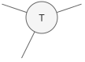

# Theoretical Background

Here, we want to give a quick, informal overview of the theory behind tensor networks for those not so familiar with the matter.
Feel free to skip this if you already know the concepts.

## Tensors
A tensor is a multi-dimensional array.
If you are familiar with the Python package `numpy`, you can think of it as a `numpy` array.
It has a number of dimensions and each dimension has a specific size.
A few examples:
- a tensor with zero dimensions is a *scalar*.
- a tensor with one dimension is a *vector*. The size of the dimension is the number of elements in the vector.
- a tensor with two dimensions is a *matrix*. The size of the two dimensions specify the number of rows and columns of the matrix.

In the case of our library, the tensor elements are always complex numbers.

A tensor is usually visualized by a circle with an outgoing line ("leg", "edge", "bond") for each dimension it has.
For example, here is a tensor with three dimensions:

## Contraction
Contraction is a binary tensor operation where specified dimensions of both tensors are multiplied together and summed over to create a new tensor.
The contracted dimensions of both tensors must match in size.

To make it more concrete, let us consider two matrices, i.e., two tensors with two dimensions each.
Say tensor 1 has dimension sizes `[a, b]` and tensor 2 has dimension sizes `[b, c]`.
Hence, the second dimension of tensor 1 has the same size as the first dimension of tensor 2.
Contracting the two tensors along this dimension is now exactly the same as performing a matrix-matrix multiplication:
It will result in a tensor `[a, c]` where each element results from summing over the product of the elements of the two tensors.

In general, any contraction can be interpreted as matrix-matrix multiplication.
We move all dimensions which are not involved to the front and move the involved dimensions to the back (and do the reverse for the second tensor).
The order of the involved dimensions must be the same in both tensors.
Then we reshape the tensors such that all involved dimensions are a single dimension and all uninvolved dimensions are a single dimension.
This leaves us with matrices which we can then multiply.
Finally, we can reshape the resulting matrix into the original dimensions again.

Example:
Contracting tensor `[a, b, c, d]` and tensor `[d, a, e, f]` along dimensions `a, d`:
1. Group into non-involved and involved: `[b, c, a, d]` and `[a, d, e, f]`
2. Reshape into matrices `[I, J]` and `[J, K]` with `I = (b, c)`, `J = (a, d)`, `K = (e, f)`
3. Multiply to get matrix `[I, K]`
4. Reshape into resulting tensor `[b, c, e, f]`

Visually, two tensors that are to be contracted along some dimensions share the legs corresponding to those dimensions.
For example, a matrix-matrix multiplication would be visualized like this:

## Tensor Networks
Often we need to contract multiple tensors together to compute something.
A tensor network is a collection of tensors that are to be contracted together.
The shape of the final tensor corresponds to the open legs of the network, i.e., the legs that are not connected to another tensor.
For example, the following tensor network would end up as a tensor with 5 dimensions:

## Contraction Paths
Contraction paths specify the order in which tensor networks are contracted.
We assume the tensors in the tensor network are enumerated in some way.
The contraction path is then a list of pairs of numbers, specifying which tensors to contract together.
> [!IMPORTANT]
> While any order will result in the same result, the required number of operations and the sizes of intermediate tensors can vary significantly!

Note that finding an optimal contraction path is NP-hard in general.
However, there exist different heuristics to find good contraction paths in practice.